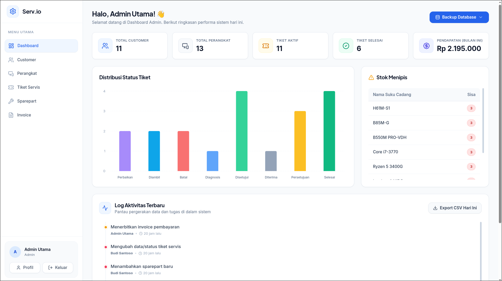
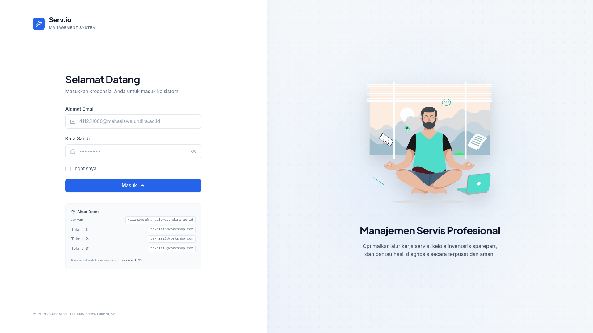
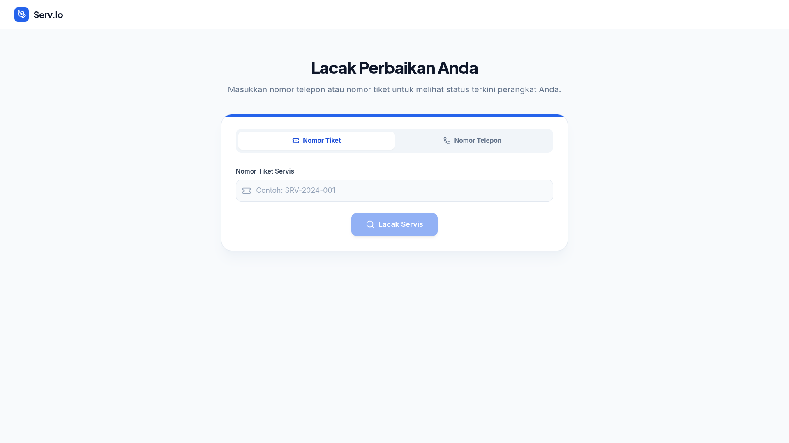
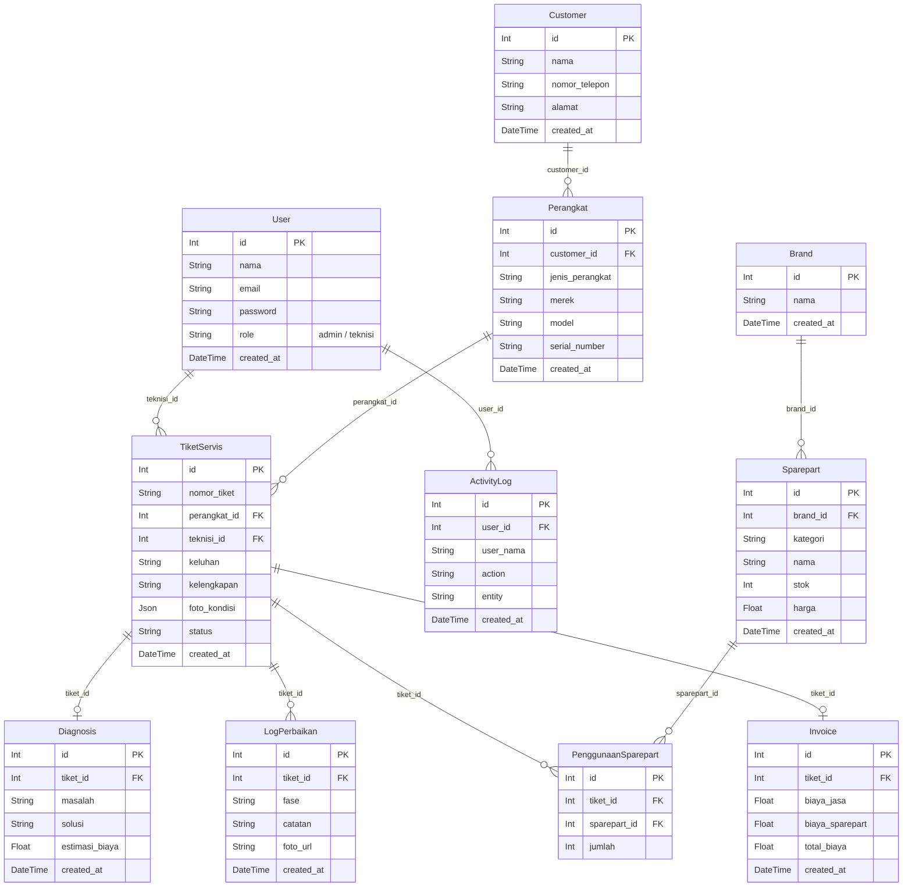
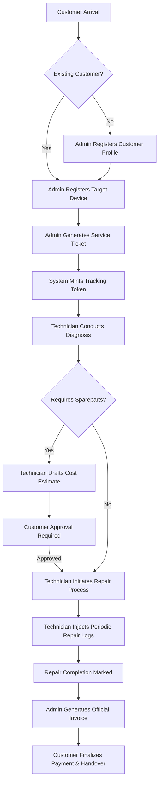

<div align="center">
    
    <h1>Serv.io Platform</h1>
    <p>Enterprise-grade IT Repair & Service Center Management System</p>

<!-- Tech Stack Badges -->
<p align="center">
  
  
  
  
  
  
  
</p>

</div>

---

## System Previews

<div align="center">
    
    <br/>
    
    <br/>
    
</div>

---

## Role-Based Access Control (RBAC) Comparison

Serv.io utilizes strict Segregation of Duties to maintain data integrity and operational security.

| Feature Module | Admin Workspace | Technician Portal | Public Tracking |
| :--- | :---: | :---: | :---: |
| **Pricing Tier / Access** | **Managerial** | **Operational** | **Read-Only** |
| Customer & Device Registration |  | - | - |
| Master Data (Spareparts) |  | - | - |
| Issue Diagnosis & Estimates | - |  | - |
| Activity Logging & Documentation | - |  | - |
| Sparepart Consumption | - |  | - |
| Invoice Generation |  | - | - |
| Ticket Assignment Override |  | - | - |
| Global Analytics Dashboard |  |  (Assigned Only) | - |
| Ticket Tracking Status |  |  |  (Via Token) |

---

## Architectural Diagrams

### Entity Relationship Diagram (ERD)
The system employs a normalized relational structure to map entities efficiently.



### System Operational Flow


---

## Deployment & Installation Guide

### Prerequisites
- Node.js (v18.x or superior)
- MySQL Server Environment (Native / Containerized)
- NPM or Yarn Package Manager

### 1. Database Initialization
Deploy a fresh MySQL database schema named `repair_workshop` via your preferred administration tool.

### 2. Backend Orchestration
Navigate into the backend subsystem to configure the API and ORM layer.
```bash
cd backend
npm install
```
Configure your environment variables by generating a `.env` file:
```env
DATABASE_URL="mysql://root:@localhost:3306/repair_workshop"
JWT_SECRET="secure_enterprise_key"
PORT=5000
```
Synchronize the Prisma schema and seed the initial administrative datasets:
```bash
npx prisma db push
node seed.js
npm run dev
```

### 3. Frontend Orchestration
Navigate into the React subsystem to compile the client application.
```bash
cd frontend
npm install
npm run dev
```

### System Credentials
The `seed.js` script provisions default accounts for immediate system access:
- **Administrator**: `admin@repair.com` (Pass: `password123`)
- **Lead Technician**: `teknisi@repair.com` (Pass: `password123`)

---
<div align="center">
    <p>Developed by Universitas Dian Nusantara Development Team</p>
    <p>Wisnu Widya Pradana | Muhammad Aditya | Rhio Isma Rizky Aziz</p>
</div>
