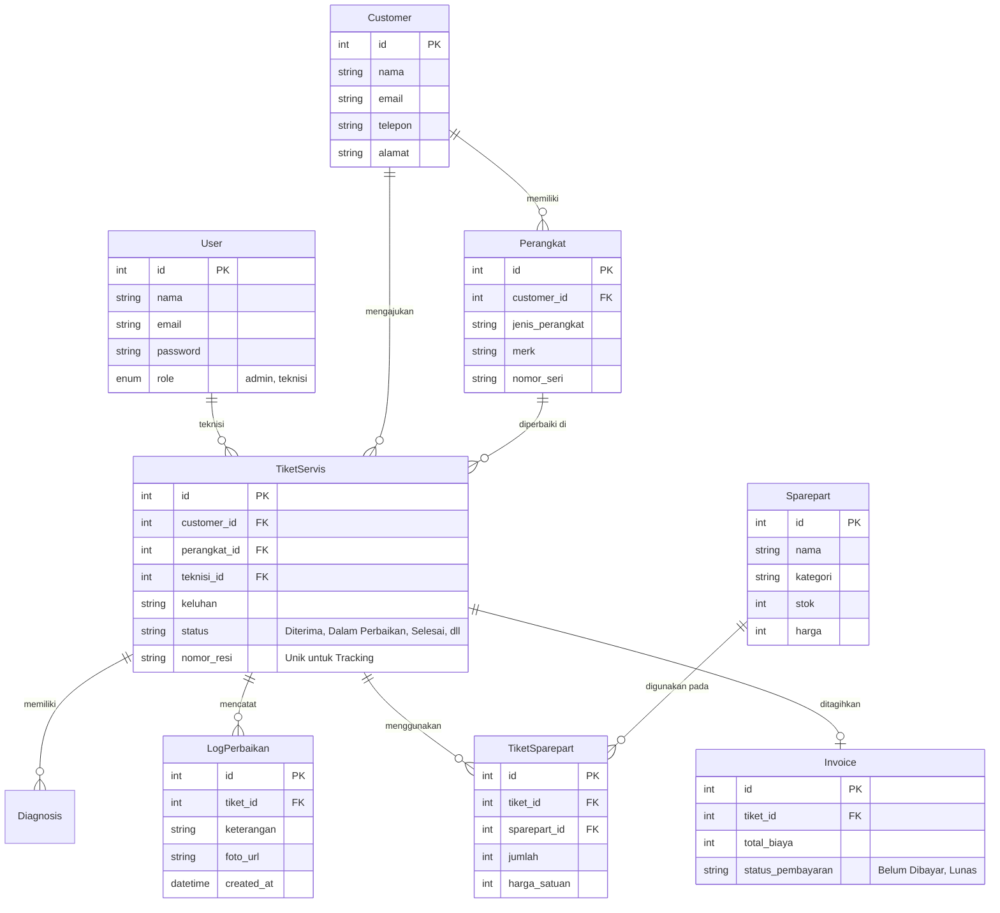
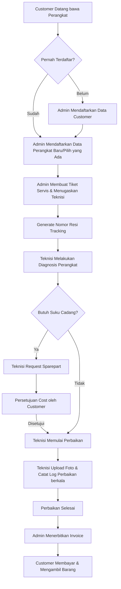
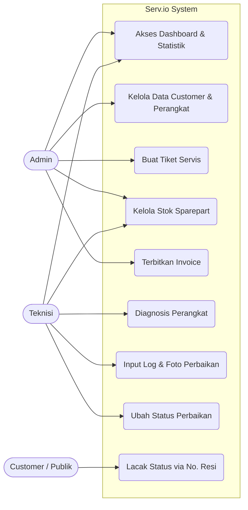

# Serv.io
Sistem Manajemen Bengkel Perbaikan Perangkat Elektronik dengan fitur terintegrasi mulai dari pendaftaran customer, inventarisasi suku cadang, pelacakan status perbaikan, log pengerjaan teknisi, hingga pembuatan invoice pembayaran.

## Tech Stack
- **Frontend**: React.js (Vite), Tailwind CSS, Recharts.
- **Backend**: Node.js, Express.js.
- **Database**: MySQL dengan Prisma ORM.
- **Autentikasi**: JSON Web Token (JWT).

---

## Struktur Relasi Database (ERD)
Sistem ini menggunakan struktur relasional untuk menghubungkan entitas Customer, Perangkat, Tiket Servis, Sparepart, dan Log Perbaikan. 



---

## Diagram Alur (System Flowchart)



---

## Alur Pengguna (Use Case Diagram)



---

## Cara Instalasi dan Setup

### Prasyarat Sistem
- Node.js versi 18 atau lebih baru.
- MySQL Server (XAMPP / Docker).

### 1. Setup Database
1. Buka MySQL server.
2. Buat database kosong dengan nama `repair_workshop` (atau nama lain).

### 2. Setup Backend
1. Buka terminal, masuk ke direktori `backend`.
2. Jalankan perintah `npm install`.
3. Buat file `.env` di dalam folder `backend` dengan format berikut:
   ```env
   DATABASE_URL="mysql://root:@localhost:3306/repair_workshop"
   JWT_SECRET="rahasia_super_aman"
   PORT=5000
   ```
   *Catatan: Sesuaikan username (root), password, dan nama database jika berbeda.*
4. Sinkronisasi struktur database menggunakan Prisma:
   ```bash
   npx prisma db push
   ```
5. Masukkan data awal (akun Admin, Teknisi, dan data dummy) ke dalam database:
   ```bash
   node seed.js
   ```
6. Jalankan server backend:
   ```bash
   npm run dev
   ```
   *Server akan berjalan di http://localhost:5000.*

### 3. Setup Frontend
1. Buka terminal baru, masuk ke direktori `frontend`.
2. Jalankan perintah `npm install`.
3. Jalankan server frontend:
   ```bash
   npm run dev
   ```
4. Buka URL yang diberikan di terminal (biasanya `http://localhost:5173`) pada browser.

### Akun Akses Default
Gunakan akun berikut untuk login pertama kali (dibuat otomatis oleh script database):
- **Admin**: Email `admin@repair.com` | Password `password123`
- **Teknisi**: Email `teknisi@repair.com` | Password `password123`
