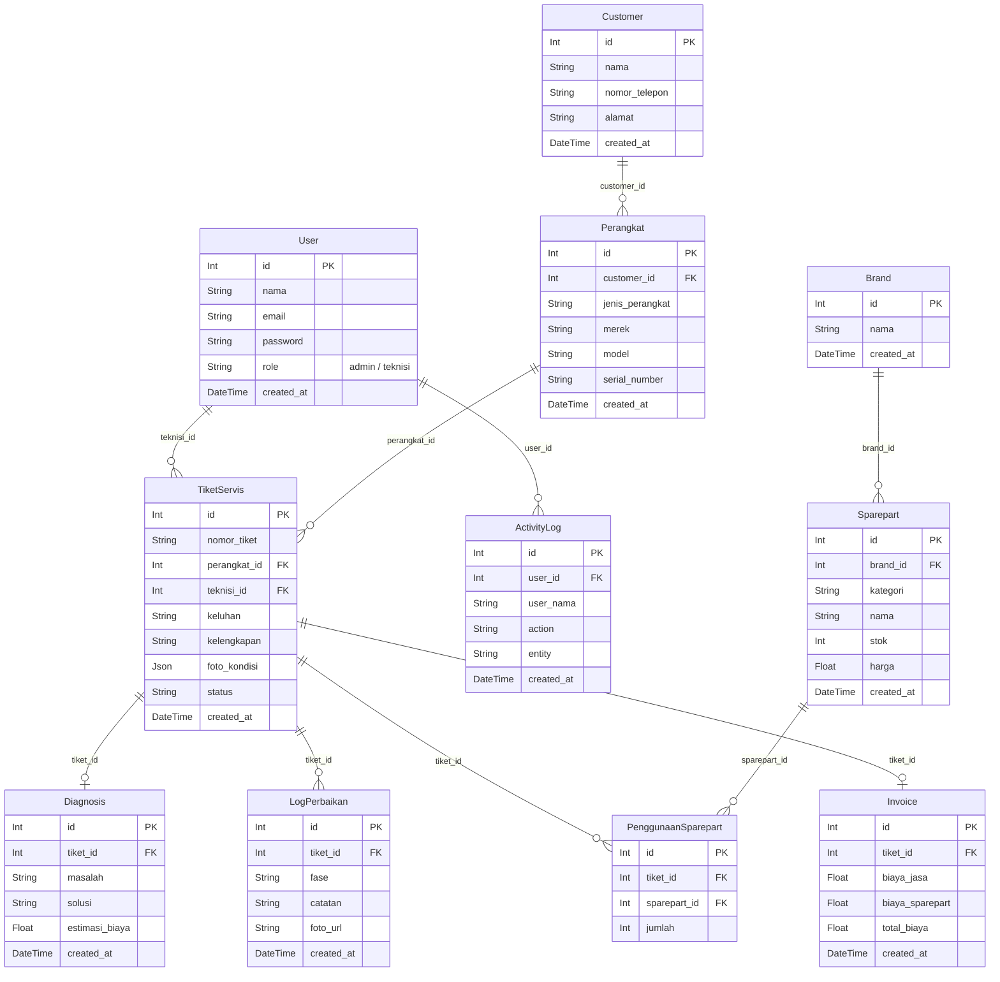
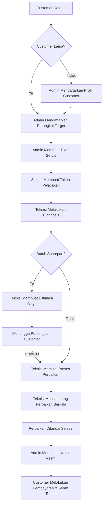
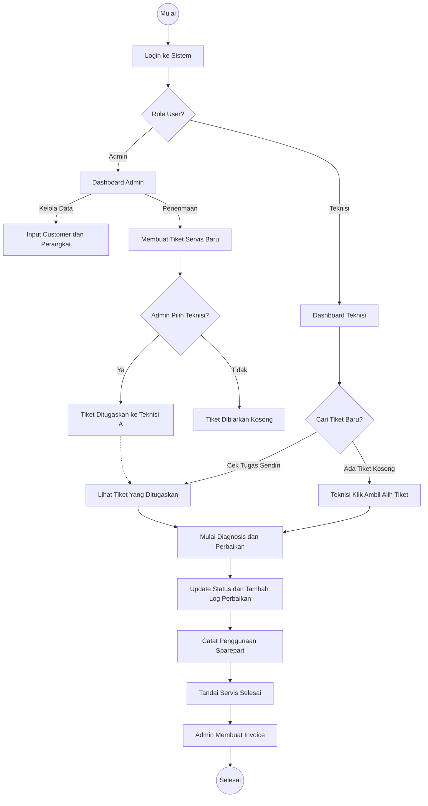

<div align="center">
    
    <h1>Platform Serv.io</h1>
    <p>Sistem Manajemen Pusat Servis & Perbaikan IT Skala Enterprise</p>

<!-- Tech Stack Badges -->
<p align="center">
  
  
  
  
  
  
  
</p>

</div>

---

## Pratinjau Sistem

<div align="center">
    
    <br/>
    
    <br/>
    
    <br/>
    <details>
    <summary><h3>✨ Lihat Lebih Banyak Screenshot (Klik untuk meluaskan)</h3></summary>
    <br/>
    
    <br/>
    
    <br/>
    
    <br/>
    
    <br/>
    
    <br/>
    
    <br/>
    
    <br/>
    
    <br/>
    
    <br/>
    
    <br/>
    
    <br/>
    
    <br/>
    
    <br/>
    
    <br/>
    
    <br/>
    
    </details>
</div>

---

## Perbandingan Role-Based Access Control (RBAC)

Serv.io menerapkan Pemisahan Tugas (Segregation of Duties) yang ketat untuk menjaga integritas data dan keamanan operasional.

| Modul Fitur | Workspace Admin | Portal Teknisi | Pelacakan Publik |
| :--- | :---: | :---: | :---: |
| **Tingkat Akses** | **Manajerial** | **Operasional** | **Hanya Baca** |
| Registrasi Customer & Perangkat |  | - | - |
| Data Master (Sparepart) |  | - | - |
| Diagnosis Masalah & Estimasi | - |  | - |
| Pencatatan Aktivitas & Dokumentasi | - |  | - |
| Penggunaan Sparepart | - |  | - |
| Pembuatan Invoice |  | - | - |
| Penugasan Tiket Servis |  | - | - |
| Dashboard Analitik Global |  |  (Hanya yang Ditugaskan) | - |
| Status Pelacakan Tiket |  |  |  (Via Token) |

---

## Diagram Arsitektur

### Entity Relationship Diagram (ERD)
Sistem menggunakan struktur relasional yang dinormalisasi untuk memetakan entitas secara efisien.


```mermaid
erDiagram
    User ||--o{ TiketServis : "teknisi_id"
    User ||--o{ ActivityLog : "user_id"
    User {
        Int id PK
        String nama
        String email
        String password
        String role "admin / teknisi"
        DateTime created_at
    }

    Customer ||--o{ Perangkat : "customer_id"
    Customer {
        Int id PK
        String nama
        String nomor_telepon
        String alamat
        DateTime created_at
    }

    Perangkat ||--o{ TiketServis : "perangkat_id"
    Perangkat {
        Int id PK
        Int customer_id FK
        String jenis_perangkat
        String merek
        String model
        String serial_number
        DateTime created_at
    }

    TiketServis ||--o| Diagnosis : "tiket_id"
    TiketServis ||--o{ LogPerbaikan : "tiket_id"
    TiketServis ||--o{ PenggunaanSparepart : "tiket_id"
    TiketServis ||--o| Invoice : "tiket_id"
    TiketServis {
        Int id PK
        String nomor_tiket
        Int perangkat_id FK
        Int teknisi_id FK
        String keluhan
        String kelengkapan
        Json foto_kondisi
        String status
        DateTime created_at
    }

    Diagnosis {
        Int id PK
        Int tiket_id FK
        String masalah
        String solusi
        Float estimasi_biaya
        DateTime created_at
    }

    LogPerbaikan {
        Int id PK
        Int tiket_id FK
        String fase
        String catatan
        String foto_url
        DateTime created_at
    }

    Brand ||--o{ Sparepart : "brand_id"
    Brand {
        Int id PK
        String nama
        DateTime created_at
    }

    Sparepart ||--o{ PenggunaanSparepart : "sparepart_id"
    Sparepart {
        Int id PK
        Int brand_id FK
        String kategori
        String nama
        Int stok
        Float harga
        DateTime created_at
    }

    PenggunaanSparepart {
        Int id PK
        Int tiket_id FK
        Int sparepart_id FK
        Int jumlah
    }

    Invoice {
        Int id PK
        Int tiket_id FK
        Float biaya_jasa
        Float biaya_sparepart
        Float total_biaya
        DateTime created_at
    }

    ActivityLog {
        Int id PK
        Int user_id FK
        String user_nama
        String action
        String entity
        DateTime created_at
    }
```

### Alur Operasional Sistem

```mermaid
flowchart TD
    A[Customer Datang] --> B{Customer Lama?};
    B -- Tidak --> C[Admin Mendaftarkan Profil Customer];
    B -- Ya --> D[Admin Mendaftarkan Perangkat Target];
    C --> D;
    D --> E[Admin Membuat Tiket Servis];
    E --> F[Sistem Membuat Token Pelacakan];
    
    F --> G[Teknisi Melakukan Diagnosis];
    G --> H{Butuh Sparepart?};
    H -- Ya --> I[Teknisi Membuat Estimasi Biaya];
    I --> J[Menunggu Persetujuan Customer];
    J -- Disetujui --> K;
    H -- Tidak --> K[Teknisi Memulai Proses Perbaikan];
    
    K --> L[Teknisi Mencatat Log Perbaikan Berkala];
    L --> M[Perbaikan Ditandai Selesai];
    M --> N[Admin Membuat Invoice Resmi];
    N --> O[Customer Melakukan Pembayaran & Serah Terima];
```

### Alur Penggunaan Aplikasi di Web (Web Flow)

Selain dari proses bisnis operasional, berikut adalah bagaimana fitur di dalam web Serv.io digunakan secara aktual oleh Admin dan Teknisi. 

#### Pembagian Tanggung Jawab:
- **Admin**: Menangani area _front-desk_ dan manajerial. Admin bertugas menambahkan Master Data (Customer, Perangkat, Sparepart, Akun User), membuat Tiket Servis baru ketika ada pelanggan, menugaskan tiket ke teknisi tertentu (bisa manual), serta mengurus penagihan (Invoice) di akhir servis.
- **Teknisi**: Menangani area operasional _back-end_ perbaikan. Teknisi bisa melihat daftar antrean servis, mendiagnosis masalah, menambahkan catatan perbaikan (_Log_), dan mencatat _sparepart_ apa saja yang digunakan selama perbaikan berlangsung.

#### Fitur Ambil Alih Tiket (Self-Assign vs Admin Assign)
Dalam web Serv.io, proses delegasi servis ke Teknisi sangat fleksibel:
1. **Admin Assign (Ditunjuk Admin)**: Saat membuat tiket servis baru atau mengedit tiket yang ada, Admin bisa langsung memilih _dropdown_ nama Teknisi yang akan menangani.
2. **Ambil Alih Tiket (Self-Assign)**: Jika Admin mengosongkan teknisi pada tiket tersebut (Status: Diterima), maka Teknisi yang sedang login dan melihat ada "Tiket Kosong" dapat langsung menekan tombol **Ambil Alih**. Ini mempercepat proses tanpa perlu menunggu arahan dari Admin.


```mermaid
flowchart TD
    Start((Mulai)) --> Login[Login ke Sistem]
    Login --> Role{Role User?}
    
    %% Alur Admin
    Role -- Admin --> AdminMenu[Dashboard Admin]
    AdminMenu -->|Kelola Data| MasterData[Input Customer dan Perangkat]
    AdminMenu -->|Penerimaan| BuatTiket[Membuat Tiket Servis Baru]
    BuatTiket --> Assign{Admin Pilih Teknisi?}
    Assign -- Ya --> TungguProses[Tiket Ditugaskan ke Teknisi A]
    Assign -- Tidak --> TiketKosong[Tiket Dibiarkan Kosong]
    
    %% Alur Teknisi
    Role -- Teknisi --> TeknisiMenu[Dashboard Teknisi]
    TeknisiMenu --> CekTiket{Cari Tiket Baru?}
    CekTiket -- Ada Tiket Kosong --> AmbilAlih[Teknisi Klik Ambil Alih Tiket]
    AmbilAlih --> ProsesTiket
    CekTiket -- Cek Tugas Sendiri --> CekTugas[Lihat Tiket Yang Ditugaskan]
    
    TungguProses -.-> CekTugas
    CekTugas --> ProsesTiket[Mulai Diagnosis dan Perbaikan]
    
    %% Proses Perbaikan Bersama
    ProsesTiket --> UpdateStatus[Update Status dan Tambah Log Perbaikan]
    UpdateStatus --> PakaiPart[Catat Penggunaan Sparepart]
    PakaiPart --> SelesaiServis[Tandai Servis Selesai]
    
    SelesaiServis --> AdminInvoice[Admin Membuat Invoice]
    AdminInvoice --> Selesai((Selesai))
```

---

## Panduan Instalasi dan Menjalankan Aplikasi

Panduan ini ditulis sedetail mungkin agar pemula sekalipun bisa menjalankan proyek ini. Ikuti langkah-langkah di bawah sesuai sistem operasi yang kamu gunakan.

### Prasyarat - Software yang Harus Diinstall Terlebih Dahulu

Sebelum memulai, pastikan software berikut sudah terpasang di komputer kamu:

| Software | Kegunaan | Link Download |
| :--- | :--- | :--- |
| **Node.js** (v18 ke atas) | Runtime JavaScript untuk menjalankan backend dan frontend | [nodejs.org](https://nodejs.org/) — Pilih versi **LTS** |
| **XAMPP** | Menyediakan server MySQL secara mudah (khusus Windows) | [apachefriends.org](https://www.apachefriends.org/) |
| **Git** | Untuk meng-clone repository ini | [git-scm.com](https://git-scm.com/) |

> **Cara cek apakah Node.js sudah terinstall:** Buka Terminal / Command Prompt, lalu ketik:
> ```
> node -v
> ```
> Jika muncul versi (contoh: `v18.17.0`), berarti sudah siap.

---

### Langkah 1: Clone Repository

Buka **Terminal** (Linux) atau **Command Prompt / PowerShell** (Windows), lalu jalankan:

```bash
git clone https://github.com/halfthew0rldaway/serv.io.git
cd serv.io
```

---

### Langkah 2: Nyalakan Server MySQL

<details>
<summary><h4>🪟 Windows - Menggunakan XAMPP</h4></summary>

1. Buka aplikasi **XAMPP Control Panel**.
2. Klik tombol **Start** pada baris **MySQL**.
3. Tunggu hingga statusnya berubah menjadi hijau (artinya MySQL sudah berjalan di port `3306`).
4. Buka browser, akses **http://localhost/phpmyadmin**.
5. Di phpMyAdmin, klik tab **"Databases"** di bagian atas.
6. Pada kolom **"Create database"**, ketik: `repair_workshop`
7. Klik tombol **Create**.

</details>

<details>
<summary><h4>🐧 Linux</h4></summary>

1. Buka Terminal.
2. Jalankan perintah berikut untuk menyalakan MySQL/MariaDB:
   ```bash
   sudo systemctl start mariadb
   # atau jika menggunakan MySQL:
   sudo systemctl start mysql
   ```
3. Buat database baru:
   ```bash
   mysql -u root -e "CREATE DATABASE IF NOT EXISTS repair_workshop;"
   ```

</details>

---

### Langkah 3: Setup dan Jalankan Backend - API Server

<details>
<summary><h4>🪟 Windows - Command Prompt / PowerShell</h4></summary>

1. Buka **Command Prompt** atau **PowerShell**, lalu masuk ke folder backend:
   ```cmd
   cd backend
   ```

2. Install semua dependency (library yang dibutuhkan):
   ```cmd
   npm install
   ```
   > Tunggu proses ini selesai. Akan muncul folder `node_modules` di dalam folder `backend`.

3. Buat file konfigurasi `.env`. Ketik perintah berikut **satu per satu**:
   ```cmd
   echo DATABASE_URL="mysql://root:@localhost:3306/repair_workshop" > .env
   echo JWT_SECRET="repair-workshop-secret-key-2026" >> .env
   echo JWT_EXPIRES_IN="7d" >> .env
   echo PORT=5001 >> .env
   ```
   > **Catatan:** Jika MySQL kamu memiliki password, ganti bagian `root:@` menjadi `root:PASSWORD_KAMU@`.

4. Sinkronkan struktur database (membuat tabel-tabel otomatis):
   ```cmd
   npx prisma db push
   ```

5. Masukkan data awal (data dummy untuk testing):
   ```cmd
   node seed.js
   ```
   > Jika berhasil, akan muncul pesan: `Seeding data realistis berhasil diselesaikan! 🚀`

6. Jalankan backend server:
   ```cmd
   npm run dev
   ```
   > Backend akan berjalan di **http://localhost:5001**. **Jangan tutup terminal ini!**

</details>

<details>
<summary><h4>🐧 Linux</h4></summary>

1. Buka Terminal, masuk ke folder backend:
   ```bash
   cd backend
   ```

2. Install semua dependency:
   ```bash
   npm install
   ```

3. Buat file konfigurasi `.env`:
   ```bash
   cat > .env << 'EOF'
   DATABASE_URL="mysql://root:@localhost:3306/repair_workshop"
   JWT_SECRET="repair-workshop-secret-key-2026"
   JWT_EXPIRES_IN="7d"
   PORT=5001
   EOF
   ```
   > **Catatan:** Jika MySQL kamu memiliki password, ganti bagian `root:@` menjadi `root:PASSWORD_KAMU@`.

4. Sinkronkan struktur database:
   ```bash
   npx prisma db push
   ```

5. Masukkan data awal:
   ```bash
   node seed.js
   ```

6. Jalankan backend server:
   ```bash
   npm run dev
   ```
   > Backend akan berjalan di **http://localhost:5001**. **Jangan tutup terminal ini!**

</details>

---

### Langkah 4: Setup dan Jalankan Frontend - Tampilan Web

> **Penting:** Buka terminal/command prompt **baru** (jangan menutup terminal backend yang tadi).

<details>
<summary><h4>🪟 Windows - Command Prompt / PowerShell</h4></summary>

1. Dari folder utama proyek, masuk ke folder frontend:
   ```cmd
   cd frontend
   ```

2. Install semua dependency:
   ```cmd
   npm install
   ```

3. Jalankan frontend:
   ```cmd
   npm run dev
   ```

4. Buka browser, akses: **http://localhost:3000** 🎉

</details>

<details>
<summary><h4>🐧 Linux</h4></summary>

1. Dari folder utama proyek, masuk ke folder frontend:
   ```bash
   cd frontend
   ```

2. Install semua dependency:
   ```bash
   npm install
   ```

3. Jalankan frontend:
   ```bash
   npm run dev
   ```

4. Buka browser, akses: **http://localhost:3000** 🎉

</details>

---

### Langkah 5: Login ke Sistem

Setelah frontend terbuka di browser, gunakan kredensial berikut untuk masuk:

| Role | Email | Password |
| :--- | :--- | :--- |
| **Admin** | `411231088@mahasiswa.undira.ac.id` | `password123` |
| **Teknisi 1** | `teknisi1@workshop.com` | `password123` |
| **Teknisi 2** | `teknisi2@workshop.com` | `password123` |
| **Teknisi 3** | `teknisi3@workshop.com` | `password123` |

> **Fitur Pelacakan Publik (Tanpa Login):** Akses halaman **http://localhost:3000/tracking** untuk melacak status tiket servis menggunakan nomor tiket.

---
<div align="center">
    <h3>Pengembang Proyek (Universitas Dian Nusantara)</h3>
    <p>
        <strong>Wisnu Widya Pradana</strong> (411231088) <br>
        <strong>Muhammad Aditya</strong> (411231139) <br>
        <strong>Rhio Isma Rizky Aziz</strong> (411231085)
    </p>
</div>
